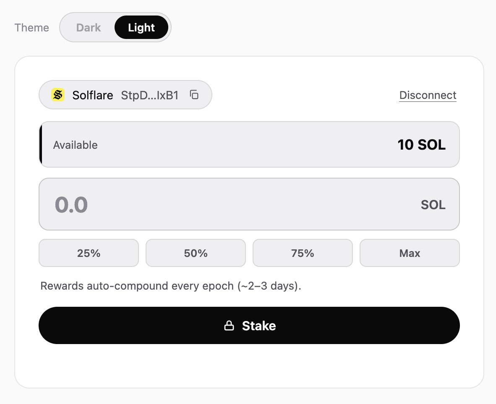

# solana-staking-widget

**Drop-in native Solana staking for any website — no backend, no build step, no framework.**



Add a non-custodial staking interface to your validator site with one `<div>` and one `<script>`. The widget builds native **Stake Program** transactions in the browser and the user signs them in their own wallet. You never touch keys or funds.

```html
<div data-sol-staking data-vote="YOUR_VOTE_ACCOUNT" data-theme="dark"></div>

<!-- One self-contained file: bundles @solana/web3.js + Buffer polyfill + the widget. -->
<script src="solana-staking-widget.bundle.js"></script>
```

The widget auto-mounts, discovers installed wallets, and handles stake, unstake and withdraw. One file, nothing else to wire up.

> ⚠️ **Production:** download `dist/solana-staking-widget.bundle.js` and **self-host it** (don't hot-link a third-party CDN for a transaction-signing script), and point `data-rpc` at your **own RPC endpoint** — ideally a thin proxy that hides your key (see [RPC proxy](#rpc-proxy)). The public RPC is heavily rate-limited.

---

## Why this one

| | solana-staking-widget | Typical alternatives |
|---|:---:|:---:|
| Backend required | ❌ none | usually required |
| Build step | ❌ none | usually required |
| Framework lock-in | ❌ vanilla JS | often framework-bound |
| Files to audit | 1 readable file | large dependency tree |
| Wallet Standard | ✅ | ✅ |
| Legacy wallet fallback | ✅ | varies |
| Non-custodial | ✅ | ✅ |
| Theming | ✅ CSS variables | varies |

It fits validators running a **static site** who don't want to operate a server just for a Stake button.

## Features

- **Native staking** — create stake account + delegate, deactivate (unstake), and withdraw.
- **Stake account list** — shows the connected wallet's stake with your validator, with live status (Activating / Active / Deactivating / Withdrawable).
- **Wallet Standard first** — auto-discovers Phantom, Solflare, Backpack, Glow, OKX, and any conforming wallet, with real wallet icons. Legacy injected providers as fallback.
- **Rewards preview** — estimated yearly rewards as the user types.
- **Theming** — `dark` / `light` out of the box, fully restyleable via CSS variables.
- **Self-contained** — injects its own styles; just one script file (plus `@solana/web3.js` and a `Buffer` polyfill).
- **Non-custodial** — transactions are built client-side and signed in the user's wallet. Funds stay under the user's own stake/withdraw authority.

## Install

### Option A — self-contained bundle (recommended)

Grab `dist/solana-staking-widget.bundle.js` (from a GitHub release, or build it with `node build.js`) and host it on your own domain. It includes `@solana/web3.js` and the `Buffer` polyfill, so it's a single script with nothing else to set up:

```html
<div data-sol-staking data-vote="YOUR_VOTE_ACCOUNT" data-rpc="/rpc" data-theme="dark"></div>
<script src="solana-staking-widget.bundle.js"></script>
```

### Option B — bring your own dependencies (smaller)

Load `@solana/web3.js` and a `Buffer` polyfill yourself, then the widget source. Order matters — **buffer → web3.js → widget** — because web3.js v1 reads a global `Buffer`:

```html
<div data-sol-staking data-vote="YOUR_VOTE_ACCOUNT" data-rpc="/rpc"></div>

<script src="/vendor/buffer.min.js"></script>
<script>window.Buffer = window.Buffer || buffer.Buffer;</script>
<script src="/vendor/solana-web3.iife.min.js"></script>
<script src="/src/staking-widget.js"></script>
```

> For production, **self-host** these files (don't hot-link a third-party CDN at runtime for a signing UI), serve over HTTPS, and pin versions. If you do use a CDN for evaluation, pin an exact version and add [SRI](https://developer.mozilla.org/docs/Web/Security/Subresource_Integrity) hashes.

### Build the bundle yourself

```bash
git clone https://github.com/ataridev/solana-staking-widget
cd solana-staking-widget
node build.js      # concatenates vendored deps + widget -> dist/solana-staking-widget.bundle.js
```

No bundler, package manager, or network needed — the pinned dependencies are vendored in `vendor/`.

> **Quick evaluation only:** you can also load the bundle straight from a GitHub tag via jsDelivr —
> `https://cdn.jsdelivr.net/gh/ataridev/solana-staking-widget@v1.0.0/dist/solana-staking-widget.bundle.js`.
> For production, self-host it instead of relying on a third-party CDN.

## Usage

### Auto-mount (recommended)

Any element with `data-sol-staking` is mounted automatically on DOM ready:

```html
<div data-sol-staking data-vote="YOUR_VOTE_ACCOUNT"></div>
```

### Programmatic

```js
SolanaStakingWidget.mount(document.getElementById('stake'), {
  vote: 'YOUR_VOTE_ACCOUNT',
  rpc: '/rpc',
  theme: 'dark'
});
```

## Options

| Attribute | JS key | Default | Description |
|---|---|---|---|
| `data-vote` | `vote` | — **(required)** | Validator vote account (base58) |
| `data-rpc` | `rpc` | `https://api.mainnet-beta.solana.com` | RPC URL. Use your own / a proxy in production |
| `data-network` | `network` | `mainnet` | `mainnet` or `devnet` (Wallet Standard chain hint) |
| `data-theme` | `theme` | `dark` | `dark` or `light` |
| `data-apy` | `apy` | `5` | APY used for the rewards preview |
| `data-validator-name` | `validatorName` | `this validator` | Label in the "Your stake with …" list |
| `data-explorer` | `explorer` | `solscan` | `solscan`, `solanafm`, or `explorer` |

## Theming

The default look is a neutral **monochrome** theme (black/white), with green/red kept only for
success/error so status stays readable. The widget injects scoped styles using CSS custom
properties — override them on the container (or `:root`) to match your brand:

```css
[data-sol-staking] {
  --sw-accent: #ffffff;     /* primary button fill */
  --sw-on-accent: #0a0a0a;  /* text on the primary button */
  --sw-bg: #0b0b0c;
  --sw-surface: #141416;
  --sw-surface-2: #1c1c1f;
  --sw-text: #fafafa;
  --sw-muted: #a0a0a8;
  --sw-line: rgba(255,255,255,.10);
  --sw-ring: rgba(255,255,255,.18); /* focus ring */
  --sw-green: #3ecf8e;      /* success / active */
  --sw-red: #ff6369;        /* error */
  --sw-radius: 14px;
}
```

`data-theme="dark"` (default) and `data-theme="light"` ship ready palettes; you can also switch at
runtime with `widget.setTheme('light')` on the instance returned by `SolanaStakingWidget.mount()`.

### Content-Security-Policy

By default the widget injects its `<style>` at runtime, which a strict `style-src 'self'` (without
`'unsafe-inline'`) will block. If you run a strict CSP, include the stylesheet yourself with the
matching id so auto-injection is skipped:

```html
<link id="sol-staking-widget-styles" rel="stylesheet" href="staking-widget.css">
```

(Or set `window.SolanaStakingWidgetNoAutoStyle = true` before the script and style `.sw-*` yourself.)
`script-src 'self'` is fully compatible — just self-host the bundle.

## RPC proxy

The browser needs a Solana RPC endpoint. The public endpoint is heavily rate-limited (it will throttle `getProgramAccounts` and `sendTransaction`), so use a provider (Helius, QuickNode, Triton…). To keep your API key **off the page**, put a thin proxy in front and set `data-rpc` to it. Ready-made recipes are in [`/proxy`](./proxy):

- [`proxy/rpc.php`](./proxy/rpc.php) — PHP (shared hosting)
- [`proxy/cloudflare-worker.js`](./proxy/cloudflare-worker.js) — Cloudflare Worker
- [`proxy/vercel-edge.js`](./proxy/vercel-edge.js) — Vercel Edge Function

Each one: restricts callers to your origin (protects your RPC credits) and allowlists only the JSON-RPC methods the widget needs.

## Security

- **Non-custodial.** The widget builds transactions and the **wallet signs** them. It cannot move funds on its own. Staked SOL stays under the user's own stake/withdraw authority.
- **Auditable.** One readable source file — not an opaque dependency tree. Pin a version and review it.
- **Supply chain.** For production, self-host `@solana/web3.js`, the `buffer` polyfill, and the widget (don't depend on a third-party CDN at runtime), and serve everything over HTTPS with a strict CSP (`script-src 'self'`).
- See [SECURITY.md](./SECURITY.md) to report issues.

Users should still verify every transaction in their wallet — that is the security boundary for any web3 dApp.

## Wallet support

Wallet Standard (auto-discovered): Phantom, Solflare, Backpack, Glow, OKX, and any conforming wallet. Legacy injected providers are used as a fallback. Account-switch and disconnect events are handled.

## Notes

- **web3.js v1, on purpose.** v1 ships a browser UMD build that runs with no bundler, which is what
  makes the zero-build embed possible. (Its successor `@solana/kit` is ESM-first and would require a
  build step.) The widget uses only the stable `StakeProgram` / `Connection` APIs.
- **Confirmation** is done by polling `getSignatureStatuses` (no websocket), so an HTTP-only RPC proxy works fine.
- **SSR-safe:** the source guards all `window`/`document` access, so importing it in Node (e.g. for tests) won't throw.
- **Liquid staking (LST)** is out of scope for v1 (native staking only). Contributions welcome.
- **Bundler users:** the standalone `src` reads `window.solanaWeb3` and `window.Buffer` at runtime; provide those globals, or use the self-contained `dist` bundle (or open an issue for an ESM build).

## Contributing

PRs welcome — see [CONTRIBUTING.md](./CONTRIBUTING.md). Good first issues: more wallet icons/fallbacks, i18n, LST tab, account split/merge, ESM build.

## License

[MIT](./LICENSE) © ataridev
